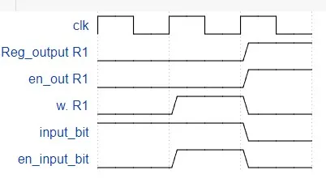
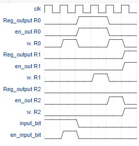
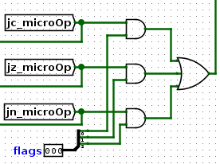

## Secuenciales

*1.¿Cuáles son y qué representa cada entrada y cada salida del componente? ¿Cuáles entradas deben ser consideradas como de control?*

### Entradas

* **clk**: señal de reloj que sincroniza el circuito. 
* **w**: señal de control que habilita la escritura en el registro.
* **Reg_in**: entrada de un bit que se va a guardar en el registro. 
* **en_out**: habilita la salida del registro.

### Salidas

* **Reg_output**: salida del registro.
* **Reg_Debug**: salida de debug.

Exceptuando **Reg_in** que es una entrada de datos, todas las demas entradas deben ser consideradas como de control, ya que son las que permiten que el registro funcione correctamente, y controlan justamente, la escritura, la salida y la entrada de datos.

### Punto 2 


### Punto 3


## OrgaSmall

### 1. Análisis

* ¿Cuál es el tamaño de la memoria?

    - El tamaño de la memoria es de 256 bytes, como la memoria almacena 256 palabras de 8 bits => tamaño de la memoria de 256 bytes

* ¿Qué tamaño tiene el `PC`?

    -El `PC` tiene un tamaño de 8 bits => tamaño de la memoria es de 256 bytes => Necesito un PC de 8 bits para manejar de 256 direcciones de memoria

* Observando el formato de instrucción y los CodOp de la hoja de datos: ¿Cuántas instrucciones nuevas se podrían agregar respetando el formato de instrucción indicado?

    * Se podrian agregar 10 instrucciones mas, ya que todas las demas estaran ocupadas exepto:

        1. **01001xxxx**
        2. **01010xxxx**
        3. **01011xxxx**
        4. **01100xxxx**
        5. **01101xxxx**
        6. **01110xxxx**
        7. **01111xxxx**
        8. **11100xxxx**
        9. **11101xxxx**
        10. **11110xxxx**

**`PC` (Contador de Programa):** ¿Qué función cumple la señal `inc`?

* La señal `inc` permite que cada vez que se ejecute una instruccion, la **UC** , le envia la señal al **PC** para que actualice la direccion a la que apunta. En resumen, salta a la proxima instruccion disponible

**`ALU` (Unidad Aritmético Lógica):** ¿Qué función cumple la señal `opW`?

* La señal `opW` es una señal de control que nos permite decidir si se escriben o no los flags de la **ALU**

**`microOrgaSmall` (`DataPath`):** ¿Para qué sirve la señal `DE_enOutImm`? ¿Qué parte del circuito indica que registro se va a leer y escribir?

* La señal `DE_enOutImm` sirve para direccionar el **PC** a la **Imm**, se utiliza en saltos condicionales, para que no vaya a la siguiente direccion, sino a la indicada por la **UC**
* La parte del circuito que indica que registro se va a leer y escribir es la **UC** 
 
**`ControlUnit` (Unidad de control):** ¿Cómo se resuelven los saltos condicionales? Describir el mecanismo.

* Los saltos condicionales se resuelven de la siguiente forma:

    1. Cuando hay un salto condicional se prende el flag de algunos de los `Jump`, en este caso usaremos el `JC`
    2. Como esta prendido el `jc_microOP` se prende la primer señal del `and`
    
             
    y si el `Carry` esta prendido (Que viene de la **ALU**), es decir el bit del flag es el `001`.

    3. Luego, si se da la condicon para hacer el `JC` alli es donde se activa la señal `DE_enOutImm` para, justamente, saltar a esa dirección. Caso contrario no se realizara el `Jump`


## 2. Ensamblar y correr
**Antes de correr el programa, identificar el comportamiento esperado:**

* Esperamos que: 
    ```asm
    JMP seguir
    ```  
    Direccione al **PC** a la direccion de memoria `seguir`
    ```asm
    seguir:
    SET R0, 0xFF
    SET R1, 0x11
    ```
    `SET` configure los registros, por ende:
    `R0` tenga escrito el valor `0xFF` y `R1` tenga escrito el valor `0x11`. 
    ```asm
    siguiente:
    ADD R0, R1
    JC siguiente
    ```
    `ADD` sume los valores de `R0` y `R1` y lo guarde en `R0`
    Si, por algun motivo, esa suma lleva a un *Carry* entonces
    `JC` direccione al **PC** a la direccion de memoria `siguiente`

    ```asm
    halt:   
    JMP halt
    ```
    En caso contrario, que la suma no lleve un *Carry*, quedaria en un loop infinito, dando a enteder que a terminado nuestro codigo

**¿Qué lugar ocupará cada instrucción en la memoria? Detallar por qué valor se reemplazarán las etiquetas:**

 *  JMP seguir ==> [0x00]

    seguir:SET R0, 0xFF    ==>[0x02]
    SET R1, 0x11     ==>[0x04] 

    siguiente: ADD R0, R1    ==>[0x06] , segunda ejecucion ==>[0x10] 
    JC siguiente      ==>[0x08], segunda ejecucion ==>[0x12] 

    halt: JMP halt    ==>[0x14] 

**Ejecutar y controlar ¿cuántos ciclos de clock son necesarios para que este código llegue a la instrucción `JMP halt`?**


* Al ejecutar el codigo, para que la UC llegue a `JMP halt`, deberian pasar 52 clocks, al llegar a este la UC activa `PC_load DE_enOutImm`, dando a entender que
esta parado en el `JMP halt`


**¿Cuántas microinstrucciones son necesarias para realizar el ADD? ¿Cuántas para el salto?**
* Para realizar `ADD` son necesarias 5 microinstrucciones.
* Para realizar `JUMP` son necesarias 2 microinstrucciones.